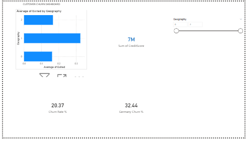
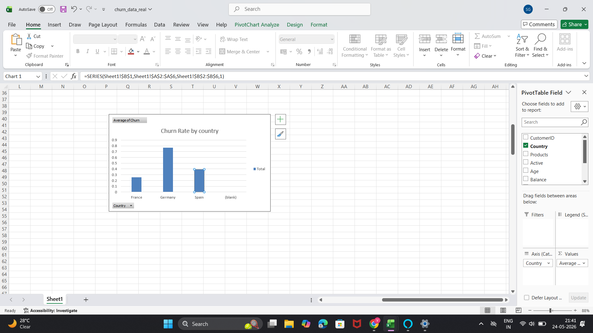

# Bank Customer Churn Prediction

## Project Overview
Predicts which bank customers will leave (churn) using machine learning, so the bank can offer retention incentives.

## Results
| Metric | Value |
|--------|-------|
| **Recall** | 86% (catches 86% of leavers) |
| **Precision** | 52% |
| **AUC** | 0.85 |

## Key Insights
- Customers with 3+ products: **83% churn** → cap products at 2
- Germany: **32% churn** vs France 16%
- Inactive members: **2.5x more likely to leave**

## Tech Stack
- Python (Pandas, XGBoost, CatBoost, SHAP)
- SMOTE for imbalanced data
- PostgreSQL for SQL queries
- Excel & Power BI for dashboards
- FastAPI for deployment

## Files
| File | Description |
|------|-------------|
| `churn_notebook.ipynb` | Complete analysis and modeling code |
| `excel_dashboard.png` | Excel dashboard screenshot |
| `powerbi_dashboard.png` | Power BI dashboard screenshot |

## Dashboards

### Excel Dashboard

### Power BI Dashboard

## SQL Queries
Window functions, CTEs, cohort retention analysis available in separate SQL file.

## How to Run
1. Open `churn_notebook.ipynb` in Google Colab
2. Run all cells
3. Model will train and evaluate

## Author
[Vedant Santosh Gaikwad]
